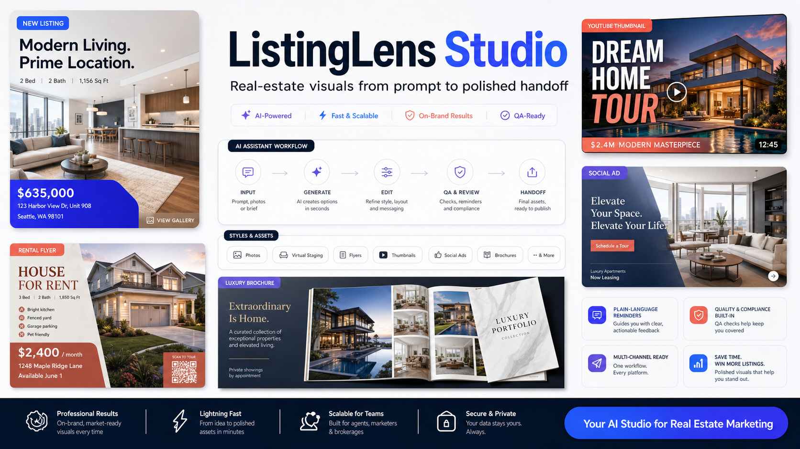
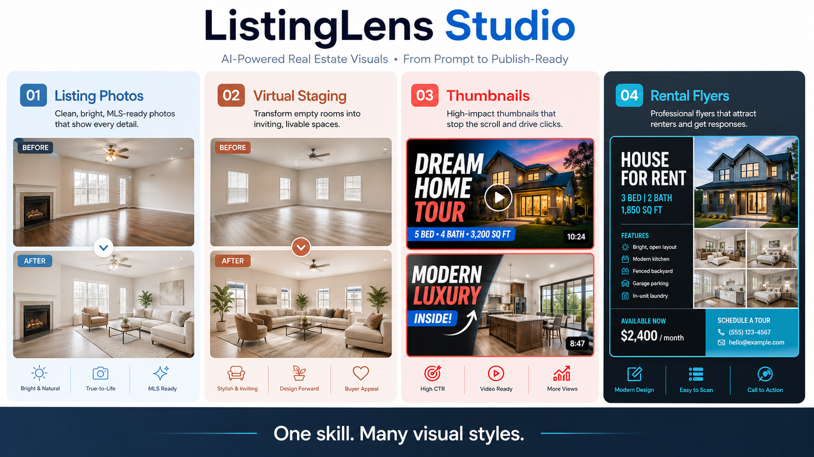
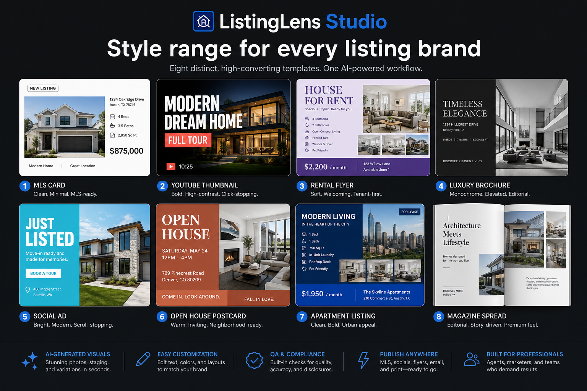
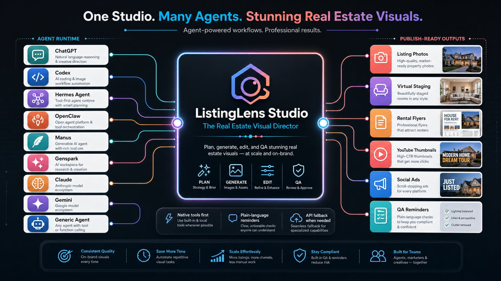

<p align="center">
  
</p>

# ListingLens Studio

**Real-estate image generation, editing, and QA for ChatGPT, Codex, Hermes Agent, OpenClaw, Manus, Genspark, and agent automation workflows.**

ListingLens Studio turns plain-language real-estate marketing requests into structured image prompts, generated visuals, edit instructions, QA reminders, and production handoff metadata. It is built for listing photos, virtual staging, day-to-dusk exteriors, rental flyers, YouTube thumbnails, social ads, listing packets, brand visuals, and multi-agent image workflows.

It is not just a prompt pack. It is an image-director skill for people who need real-estate visuals that look polished, stay practical, and come with the reminders nontechnical users usually miss.

## Why It Exists

Real-estate visuals are not generic AI art.

A listing photo needs factual preservation. A virtual staging image needs a disclosure reminder. A flyer needs readable hierarchy. A YouTube thumbnail needs mobile clarity. A brokerage or rental workflow may need source-rights notes, platform specs, and a before/after QA check.

ListingLens Studio gives agents and automation systems a real-estate-aware visual workflow instead of a blank prompt box.

<p align="center">
  
</p>

## What It Helps Create

- Listing photo enhancement prompts and edit workflows
- Empty-room virtual staging concepts
- Declutter and depersonalize image directions
- Exterior cleanup and day-to-dusk visuals
- Renovation and curb-appeal concepts
- YouTube thumbnails for property tours
- Open-house, rental, and house-for-rent flyers
- Instagram, Facebook, LinkedIn, and email visuals
- Listing packet covers and property feature graphics
- Agent profile, header, and personal-brand visuals

## Built For Style Variety

ListingLens Studio is not locked to one house style. It can direct clean MLS imagery, bold creator thumbnails, rental-friendly flyers, monochrome luxury brochures, bright social ads, editorial listing packets, and brand-specific variants.

<p align="center">
  
</p>

## Built For Nontechnical Users

Most agents and property managers do not think in model parameters, alpha masks, compliance gates, backend routing, or JSON job packets.

ListingLens Studio translates normal requests into useful image workflows and plain-language reminders:

- "To use this in a live listing, confirm you have permission to edit and publish the photo."
- "This virtual staging image should be labeled as virtually staged."
- "Exact phone numbers, QR codes, MLS IDs, logos, and legal text should be finished in Canva, Figma, Photoshop, or another editable tool."
- "This can continue as a draft concept, but it is not listing-safe until the source and output are visually checked side by side."

The skill does not punish incomplete requests. It returns `needs_info`, `ready_with_notes`, or a safe draft path so users keep moving.

## Agent Integrations

ListingLens Studio works as an image-director layer across modern agent systems:

- ChatGPT and Codex native image tools
- Hermes Agent image-generation toolsets
- OpenClaw adapters
- Manus workflows
- Genspark workflows
- Claude, Gemini, Cursor, Goose, Perplexity, and generic agent runtimes
- Local OpenAI Image API / CLI workflows when explicit file control is needed

The skill checks for native image tools before API keys, so agents do not incorrectly stop just because `OPENAI_API_KEY` is missing.

<p align="center">
  
</p>

## How The Workflow Works

1. Understand the asset: listing photo, staged room, thumbnail, flyer, social ad, or concept.
2. Choose the best backend: native ChatGPT/Codex image tool, Hermes, OpenClaw, Manus, Genspark, or CLI/API.
3. Build a production image prompt with real-estate constraints.
4. Generate or edit the visual.
5. Return image metadata, source roles, disclosure reminders, and QA notes.
6. For listing-adjacent work, remind the user what must be checked before publishing.

## Commercial Use Cases

- A realtor creates a polished rental flyer from a short property brief.
- A brokerage gives agents a more consistent visual QA workflow.
- A marketing assistant turns listing photos into YouTube thumbnails and social posts.
- A property manager creates draft visuals for rental campaigns.
- An automation agency packages property-image workflows into Hermes or OpenClaw.
- A ChatGPT consultant sells a practical real-estate visual skill to local agents.

## What Makes It Valuable

**Real-estate specific:** Built around listing photos, virtual staging, exterior edits, flyers, thumbnails, social ads, and property marketing assets.

**Plain-language reminders:** Helps users understand missing rights, disclosures, platform details, exact text handoff, and QA needs without sounding like an API validator.

**Native image tools first:** ChatGPT/Codex instances are explicitly told to generate images directly when native tools are available.

**Agent-ready architecture:** Includes structured job routing for Hermes, OpenClaw, Manus, Genspark, Claude, Gemini, Cursor, Goose, Perplexity, and generic orchestrators.

**Production handoff:** Returns prompts, metadata, source image roles, disclosure notes, backend used, and QA summaries.

**Better visual discipline:** Encourages safe areas, platform specs, mobile readability, style variation, factual preservation, and editable-tool handoff for exact text/logos.

## Included Files

```text
SKILL.md                         Main skill instructions
agents/openai.yaml               Marketplace/display metadata
references/agent-integrations.md ChatGPT, Hermes, OpenClaw, Manus, Genspark, and generic runtime routing
references/real-estate-playbook.md Real-estate scenarios, preservation rules, disclosures, QA
references/marketing-playbook.md Thumbnails, flyers, social ads, print/layout handoff
references/prompt-craft.md Prompt templates, QA checklist, exact-text guidance
references/api-and-execution.md Local GPT Image API/CLI notes
scripts/generate_image.py        Optional local CLI/API image runner
scripts/validate_agent_job.py    Friendly agent job checker with needs_info reminders
assets/readme/                   README marketing visuals
```

## Honest Limits

ListingLens Studio is not a legal compliance engine. It does not guarantee MLS approval, platform approval, fair-housing compliance, or sales results.

It helps teams produce better real-estate image prompts, visuals, handoffs, and reminders. Human review is still required before publishing listing, rental, brokerage, paid-ad, or legal/regulated marketing materials.

## Positioning

**ListingLens Studio is the real-estate visual workflow layer your AI agent was missing.**

It helps turn "make me a flyer," "stage this room," or "create a thumbnail" into a professional image process with better prompts, better routing, better reminders, and better handoff.
